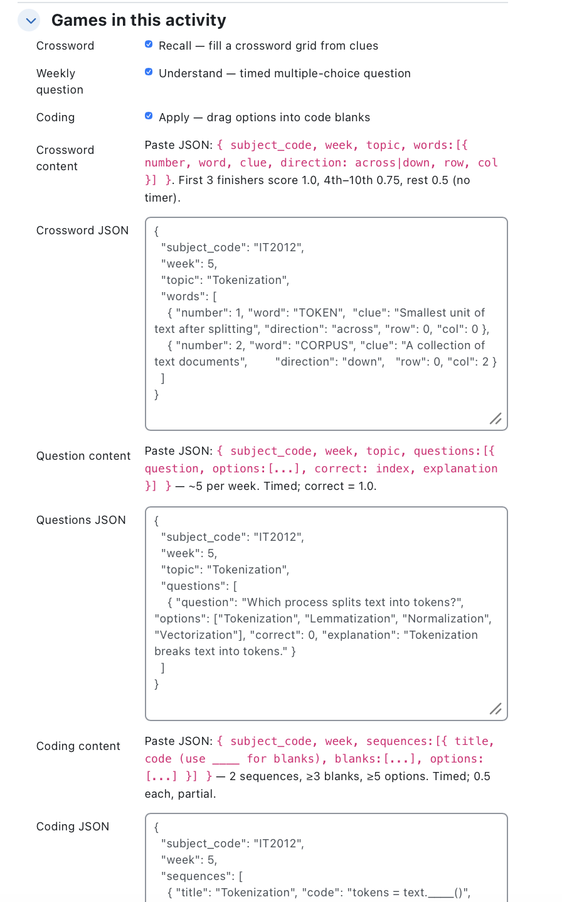

# 🎮 Agon — Gamified Learning for Moodle

> **`mod_agon`** · A Moodle activity that turns a week's course topic into a short, competitive run of mini-games — so students prep for quizzes by *playing*.

> **Status: Phase 2 — server-authoritative backend (in progress).** The full run plays inside Moodle, and scoring, attempts, hints and the course leaderboard are now **real and server-side** — answers never reach the browser, one attempt and one hint per game are enforced. Still pending: gradebook export and server-enforced timers + per-attempt randomization.

## 📸 Screens

| Opening | Crossword | Weekly question |
| --- | --- | --- |
|  |  |  |

| Coding | Completion | Teacher config |
| --- | --- | --- |
|  |  |  |

## ✨ What is Agon?

Agon (Greek for *contest*) is a generic, reusable Moodle activity module. A teacher drops it into any course, configures a week's content, and students get a fun, competitive way to revise — with one **course-wide leaderboard** and **extra grade points** for top performers. Designed to work for **any subject**.

## 🪜 The learning ladder

A student plays a linear run on the week's topic — each game asks them to do **more** with it (Bloom's *recall → understand → apply*):

| Step | Game | Trains | Scoring |
| --- | --- | --- | --- |
| 1 | **Crossword** | Recall | no timer · full solve by finish-rank: 1st–3rd **1.0**, 4th–10th **0.75**, later **0.5** · partial up to **0.49** |
| 2 | **Weekly Question** | Understand | timed · correct = **1.0**, wrong = **0** |
| 3 | **Coding** | Apply | timed · 2 sequences × **0.5**, partial credit per correct placement |

**One hint** and **one attempt**; all points **sum into a single course-wide leaderboard**. On finishing, the student sees today's score + a leaderboard preview.

## 🎮 Play experience

A **Start gate + countdown** on the timed games (the question/code stay hidden until you press Start), smooth **screen transitions**, **per-game hints** (reveal a crossword letter, show the question's explanation, or cue the next code blank), **instant feedback** on every screen (what you got right/wrong, with an animated count-up final score), and a **tap-friendly** UI for phones.

## 👤 Two views

- **Student** — plays the run: **Start → Crossword → Weekly question → Coding → Score** (bottom-nav stepper).
- **Professor / assistant** — **doesn't play**: **configures** the activity (picks games + pastes each game's **JSON** content, validated on save) and **monitors** (student attempts — searchable by name and filterable by state — plus the course leaderboard).

## 🛡️ Anti-AI by design

Real grade points are on the line, so the goal is **honest play faster than cheating** (not "AI-proof"). Implemented in the UI:

- **Start gate + countdown** — the question (10s) and coding (45s) stay hidden behind a Start button; the content reveals and the clock starts only when the student commits, so they can't pre-read or screenshot before the timer. Time-up auto-submits.
- **Weekly question** — the options are **blurred** (tap/hover to read one), so the whole set can't be screenshotted at once.
- **Coding** — revealed **one line at a time**, and revealing the next line **locks the lines above** — no reveal-everything-then-screenshot.
- **Crossword** — deliberately the low-stakes, shareable warm-up.

**Scoring is now server-authoritative** — answers never reach the browser (`window.AGON` ships clues, options and code-with-blanks only; the `correct` index and coding `blanks` stay on the server), the engine grades server-side, and one attempt + one hint per game are enforced. The reveal of each game's answers + explanation only comes back *after* you submit it. Still to come: **server-enforced timers** and **per-attempt randomization** — today the countdown is client-side display.

## 🧩 Architecture (short)

**One engine + pluggable games** — a shared server-side core (`classes/local/`: content, scoring, attempts, leaderboard) with each game as a swappable "renderer." Teachers choose which games an activity includes. The student play is an **AMD module** (`mod_agon/player`) that drives the run through web services (`classes/external/`); the teacher monitor is plain JS. Rendered via Mustache templates, styled by a scoped `styles.css` (Moodle-blue theme).

→ Full design: **[plan.md](plan.md)** · Architecture: **[docs/architecture.md](docs/architecture.md)** · Setup & handover: **[HANDOVER.md](HANDOVER.md)**

## 🗺️ Roadmap

- **Phase 0 — Setup:** ✅ moodle-docker, `mod_agon` scaffolded, installed, live.
- **Phase 1 — Playable in Moodle:** ✅ student game + teacher config/monitor; content-driven play.
- **Phase 2 — Real backend:** ✅ server-side scoring engine, attempt tracking, live cumulative leaderboard, capabilities, real privacy provider, AMD front-end + answer-split, real PHPUnit coverage. **Remaining:** gradebook export, server-enforced timers + per-attempt randomization. ← *here*
- **Phase 3 — Full experience:** daily challenge + streaks, glossary / question-bank import, transitions/animations, accessibility, touch support, dark mode, backup/restore.

## 🚀 Getting started

**Run it in Moodle (dev):** with [moodle-docker](https://github.com/moodlehq/moodle-docker), place this folder at `<moodle>/mod/agon` and install from the admin *Notifications* page. Full setup, test accounts, and gotchas are in **[HANDOVER.md](HANDOVER.md)**.

**Install on another Moodle:** zip the plugin with a single top folder named `agon` and upload via *Site administration → Plugins → Install plugins* (built on **Moodle 4.5 LTS**).

**Static design mock (no Moodle):** open [`prototype/index.html`](prototype/index.html) in a browser.

## 📁 Repository layout

This repo **is** the `mod_agon` plugin (installs to `mod/agon`):
- plugin source at the root — `version.php`, `lib.php`, `mod_form.php`, `view.php`, `db/`, `lang/`, `pix/`, `styles.css`, `templates/`, `tests/`
- `classes/` — the engine: `local/` (scoring, attempts, content, leaderboard), `external/` (web services), `privacy/`, `event/`
- `amd/` — the student AMD player; `js/` — the teacher monitor
- `prototype/` — standalone clickable UI mock (design only; not shipped to Moodle)
- `plan.md`, `docs/`, `HANDOVER.md` — plan, architecture, and handover notes

## 📜 License

GNU GPL v3 or later — like Moodle itself. See [LICENSE.md](LICENSE.md).

## 🎓 Credits

A university project. Built on Moodle; scaffolded with `tool_pluginskel`; design & code assisted with Claude Code.
