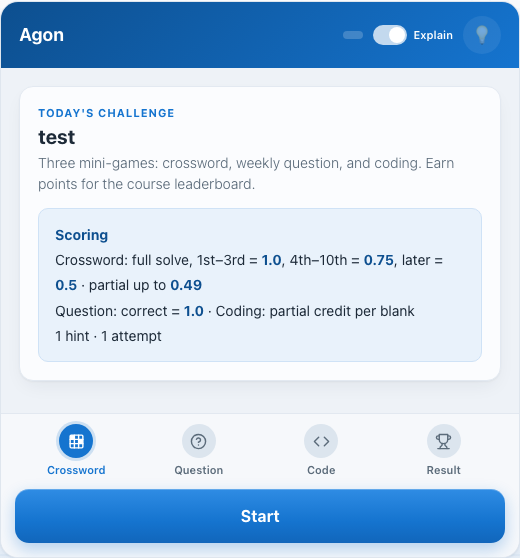
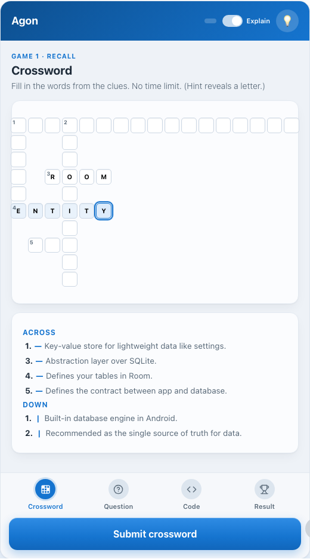
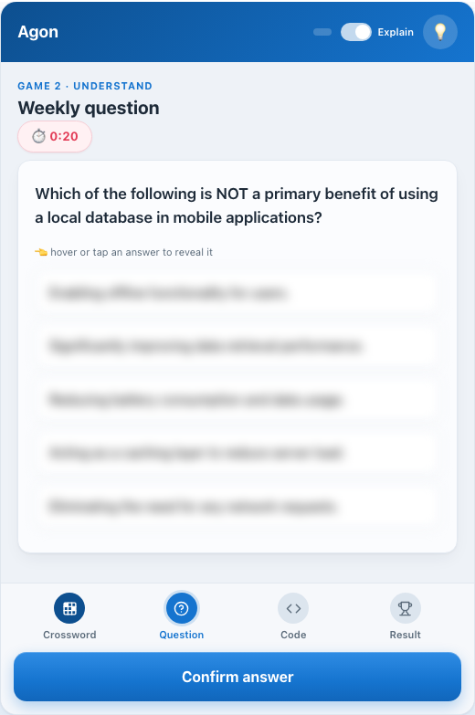
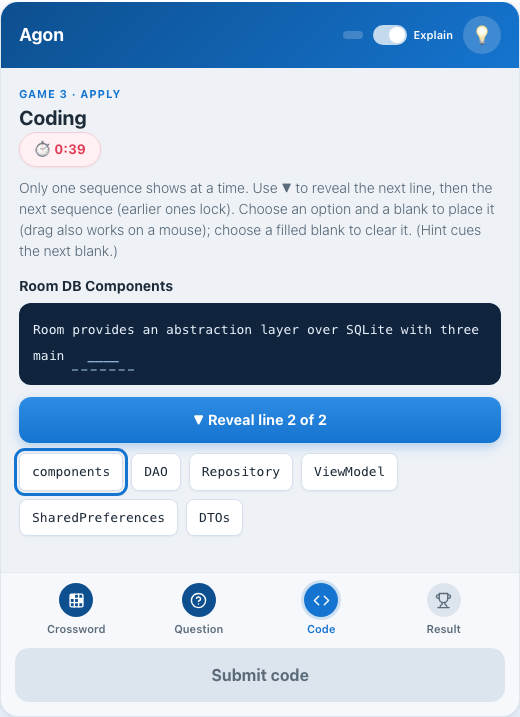
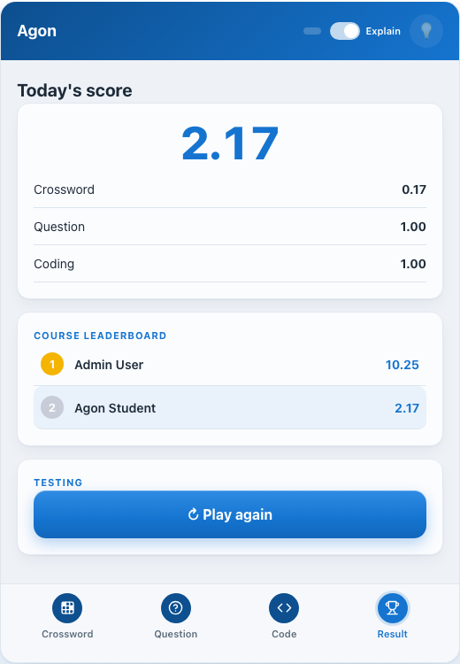
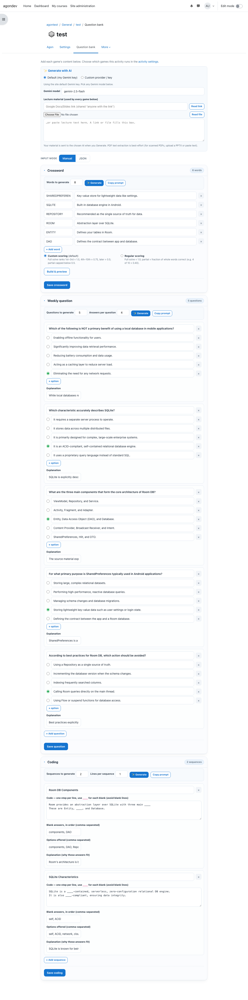

# 🎮 Agon — Gamified Learning for Moodle

> **`mod_agon`** · A Moodle activity that turns a week's course topic into a short, competitive run of mini-games — so students prep for quizzes by *playing*.

> **Status:** playable end-to-end on **Moodle 4.5 LTS**. Scoring, attempts, hints and the cumulative course leaderboard are **server-authoritative**; a teacher **Question bank** authors content by hand, as JSON, or with **AI generation**; cheating is resisted with **server-side lazy-loading**, tight timers, and progressive reveal. Tested: **PHPUnit (103 tests, ~95% line coverage of the engine + services) + Behat flows + Node builder tests**. Release **0.3.1**.

## 📸 Screens

| Opening | Crossword | Weekly question |
| --- | --- | --- |
|  |  |  |

| Coding | Completion | Question bank (teacher) |
| --- | --- | --- |
|  |  |  |

More states in [docs/img/](docs/img/): the start gates + timers (`question_timer`, `coding_timer`), reveal-on-submit feedback (`crossword_check`, `question_reveal`, `coding_check`), the coding reveal/lock mechanic (`coding_reveal`), and the slimmed activity settings (`config`).

## ✨ What is Agon?

Agon (Greek for *contest*) is a generic, reusable Moodle activity module. A teacher drops it into any course, authors a week's content, and students get a fun, competitive way to revise — with one **course-wide leaderboard**; top performers earn **extra grade points** (awarded by the professor off the leaderboard — automatic gradebook export is a planned step). Designed to work for **any subject**.

## 🪜 The learning ladder

A student plays a linear run on the week's topic — each game asks them to do **more** with it (Bloom's *recall → understand → apply*):

| Step | Game | Trains | Timing | Scoring |
| --- | --- | --- | --- | --- |
| 1 | **Crossword** | Recall | no timer | teacher picks: *finish-rank* (1st–3rd **1.0**, 4th–10th **0.75**, later **0.5**; partial ≤ **0.49**) or *regular* (fraction of whole words correct) |
| 2 | **Weekly question** | Understand | **10 / 15 / 20 / 25s** by number of options (3–6) | correct = **1.0**, wrong = **0** |
| 3 | **Coding** | Apply | one clock = **14s per sequence + 6s per extra line** | partial credit per correct blank |

**One hint** and **one attempt** per run; every point **sums into a single course-wide leaderboard**. On finishing, the student sees today's score + a leaderboard preview.

## 🎮 Play experience

- **Start gate + countdown** on the timed games — the question/code stay hidden until the student presses Start; the clock then runs and time-up auto-submits.
- **Explain toggle** (on by default) shows *why* the answer is right on the question feedback and the coding review.
- **One hint per attempt**, spent wherever the student chooses:
  - **Crossword** → reveals `ceil(words / 2)` random letters onto the grid;
  - **Question** → a **50/50**: greys out `floor(options / 2)` of the wrong answers;
  - **Coding** → marks the correct option chips for the sequence in view.
- **Instant per-screen feedback**, an animated score **count-up**, and a **tap-friendly** UI for phones. Keyboard-operable with ARIA labels + live announcements.

## 👤 Two views

- **Student** — plays the run: **Start → Crossword → Weekly question → Coding → Score** (bottom-nav stepper).
- **Professor / assistant** — **doesn't play**: **authors** content in the Question bank and **monitors** (student attempts — searchable by name, filterable by state — plus the course leaderboard).

## 🏗️ Authoring — the Question bank

A **Question bank** tab on the activity (teachers only) authors each game:

- **Manual ⇄ JSON** editors per game; a **crossword builder** lays out a grid from a word/clue list and previews it; per-game **Save** validates before storing.
- **AI generation** (optional, admin-enabled) from lecture material:
  - **Default** mode uses the site **Google Gemini** key (pick any Gemini model); **Custom** mode takes your own **Gemini / Claude / ChatGPT** key + model. No key? **Copy prompt** builds the prompt to paste into any chatbot.
  - **Source material** by paste, a shared **Google Docs/Slides** link, or a **PDF/PPTX** upload (best-effort text extraction).
  - Per-game counts: how many words / questions / sequences, plus **answers per question** (3–6) and **lines per sequence** (1–5).

## 🛡️ Anti-cheat by design

Real grade points are on the line, so the goal is **honest play faster than cheating** (not "AI-proof"):

- **Server-authoritative scoring** — answers never reach the browser. `window.AGON` ships clues, options and code-with-blanks only; the `correct` index and coding `blanks` stay on the server, which grades every submission. Answers + explanations come back *only after* a game is submitted.
- **Coding is lazy-loaded per sequence** — only the sequence in view is ever in the page. Each sequence's code + options are fetched one at a time (`mod_agon_get_sequence`); advancing **unloads** the finished sequence to a locked placeholder (nothing to screenshot), and later sequences aren't fetched yet. Within a sequence, lines reveal one at a time and revealing a line **locks** the ones above. **Submit stays locked until every sequence is revealed**, so a stray click can't skip ahead.
- **Weekly question** — options are **blurred** (tap/hover to read one), with a short option-count-scaled timer.
- **Crossword** — deliberately the low-stakes, shareable warm-up.
- **One attempt + one hint per attempt**, both enforced server-side.

## 🧩 Architecture (short)

**One engine + pluggable games** — a shared server-side core (`classes/local/`: `content`, `scoring`, `attempt`, `leaderboard`, `ai`) with each game as a swappable "renderer." The student play is an **AMD module** (`mod_agon/player`) that drives the run through web services (`classes/external/`); the teacher monitor is plain JS. Rendered via Mustache templates, styled by a scoped `styles.css`.

→ Fuller design notes live in **[plan.md](plan.md)** and **[docs/architecture.md](docs/architecture.md)**.

## 🧪 Tests

| Suite | What it covers | Run (from the Moodle root / container) |
| --- | --- | --- |
| **PHPUnit** — `tests/` | the engine (`scoring`, `content`, `attempt`, `leaderboard`, `ai` with mocked HTTP), all 11 web services, `lib.php` callbacks, events, the generator and the privacy provider — **103 tests, ~95% line / 81% method coverage** of `classes/` + `lib.php` (whitelist in `tests/coverage.php`) | `vendor/bin/phpunit --testsuite mod_agon_testsuite` — coverage: `php admin/tool/phpunit/cli/util.php --buildcomponentconfigs`, then `php -d pcov.enabled=1 -d pcov.directory=$(pwd)/mod/agon vendor/bin/phpunit -c mod/agon/phpunit.xml --coverage-text` |
| **Behat** — `tests/behat/` | the real flows in a browser: the full student run (crossword typing → timed question → lazy-loaded coding → review → results + leaderboard), mid-run resume, the teacher monitor + Question bank tab + bank save, and the guard rails (not-configured notice, disabled games) | `php admin/tool/behat/cli/init.php`, then `vendor/bin/behat --config <behatroot>/behatrun/behat/behat.yml --tags=@mod_agon` |
| **Node** — `tests/js/` | the pure crossword **builder engine** (validation, placement legality, determinism, numbering, grid consistency) | `node mod/agon/tests/js/crossword_test.js` |

In moodle-docker, prefix the PHP commands with `bin/moodle-docker-compose exec webserver` (or `docker exec moodle-docker-webserver-1`). Remember the bind-mount gotcha below when tests read stale files.

## 🚀 Run it locally (moodle-docker)

```sh
# one-time: Moodle core + docker tooling (see the moodle-docker README)
#   ~/documents/moodle-dev/moodle          (Moodle 4.5, branch MOODLE_405_STABLE)
#   ~/documents/moodle-dev/moodle-docker    (github.com/moodlehq/moodle-docker)
# this plugin lives at ~/documents/moodle-dev/moodle/mod/agon  (it IS this git repo)

cd ~/documents/moodle-dev/moodle-docker
export MOODLE_DOCKER_WWWROOT=~/documents/moodle-dev/moodle
export MOODLE_DOCKER_DB=pgsql
export MOODLE_DOCKER_WEB_PORT=8000
bin/moodle-docker-compose up -d          # start (stop/start to pause/resume)
```

Moodle runs at **http://localhost:8000**.

- **Admin:** `admin` / `Admin123!`
- **Test student** (enrolled in the test course): `agonstu` / `Agonstu123!`

To see the **student** game, log in as `agonstu` (an incognito window is cleanest); as admin you get the **teacher monitor**. Avoid "Switch role to Student" — it leaves a hybrid edit state.

### 🧪 Testing mode (replay without rebuilding)

One attempt per student is enforced. For testing, turn on **Site administration → Plugins → Activity modules → Agon → Testing mode**: a **Play again** button then appears on the results screen and resets your attempt. (Leave it **off** in a real course.)

### 🤖 Enabling AI generation

Off by default. Turn on **Enable AI generation** in the same settings page and add a **Google API key** — either in the admin field, or as a file-based secret in `config.php`:

```php
$CFG->forced_plugin_settings['mod_agon']['aiapikey'] = 'YOUR_GEMINI_KEY';
```

Teachers can always use **Copy prompt** with no key.

## 🔧 Dev gotchas (these cost real time)

- **Bind-mount sync lag.** After adding a **new** file/folder, PHP can't see it until `bin/moodle-docker-compose restart webserver` (occasionally it lags on edited files too — if a change won't show, restart and re-check). New classes also want `find /var/www/moodledata -name 'core_component*.php' -delete` then `php admin/cli/purge_caches.php`.
- **After editing templates / CSS / AMD**, run `... exec -T webserver php admin/cli/purge_caches.php`.
- **Student JS is an AMD module** (`amd/src/*.js`). The container has no grunt, so after editing a source file, **mirror it to the build** (`cp amd/src/player.js amd/build/player.min.js`, likewise `bank.js`, `crossword.js`) and purge caches.
- **New web services / DB columns / capabilities** need a **version bump** in `version.php` + `php admin/cli/upgrade.php`. (Plain settings and adding optional WS params do not.)
- `$PAGE->requires->js($url, $inhead)` — second arg **must be `false`** (footer) so the script runs *after* the inline `window.AGON` data.

## 🗂️ Key files

| Path | What |
| --- | --- |
| `version.php` | plugin version (bump for DB columns / web services / capabilities) |
| `db/install.xml`, `db/upgrade.php` | schema: `agon` (`game*` toggles + `content*` JSON) + `agon_attempt` (scores, state, `submittedgames`/`hintsused`) |
| `db/access.php`, `db/services.php` | capabilities; web-service definitions |
| `mod_form.php` | settings form — just the three game toggles |
| `bank.php`, `templates/bank.mustache`, `amd/src/bank.js` | the **Question bank** authoring screen (manual/JSON, crossword builder, AI generation) |
| `settings.php` | admin settings — AI provider/key/model + **Testing mode** |
| `view.php` | branches student play / teacher monitor; builds answer-free `window.AGON`; handles `?playagain=1` (test mode) |
| `classes/local/` | engine: `content` (answer-split + feedback/hint + lazy sequence), `scoring`, `attempt`, `leaderboard`, `ai` |
| `classes/external/` | web services: `start_attempt`, `submit_game`, `finish_attempt`, `get_hint`, **`get_sequence`**, `get_leaderboard`, `save_content`, `ai_prompt`, `ai_generate`, `fetch_source`, `extract_file` |
| `classes/privacy/provider.php` | privacy provider (attempts: export + delete) |
| `amd/src/player.js` (+ `amd/build/`) | the student play flow (hand-mirrored build) |
| `amd/src/crossword.js` | crossword grid builder (shared by the bank preview + play) |
| `templates/student.mustache`, `professor.mustache` | the UI markup |
| `js/professor.js` | teacher monitor table (search + state filter) |
| `styles.css` | scoped under `.agon` |
| `pix/monologo.svg` | branded AGON puzzle-cube activity icon |
| `lib.php` | Moodle callbacks: instance add/update/delete, `agon_supports`, branded icon, the Question-bank nav tab |
| `tests/` | PHPUnit (+ `coverage.php` whitelist), `tests/behat/` features, `tests/js/` Node builder tests |
| `prototype/` | standalone HTML/CSS/JS design mock (not shipped) |

## 📦 Install on another Moodle

Zip the plugin with a single top folder named **`agon`** (exclude `prototype/`, `.git/`, docs if you like), then *Site administration → Plugins → Install plugins → upload*. Must match the target Moodle version (built on **4.5 LTS**).

## 📁 Repository layout

This repo **is** the `mod_agon` plugin (installs to `mod/agon`):
- plugin source at the root — `version.php`, `lib.php`, `mod_form.php`, `view.php`, `bank.php`, `settings.php`, `db/`, `lang/`, `pix/`, `styles.css`, `templates/`, `tests/`
- `classes/` — `local/` (engine), `external/` (web services), `privacy/`, `event/`
- `amd/` — the student AMD player + crossword builder; `js/` — the teacher monitor
- `prototype/` — standalone clickable UI mock (design only; not shipped)

## 📜 License

GNU GPL v3 or later — like Moodle itself. See [LICENSE.md](LICENSE.md).

## 🎓 Credits

A university project. Built on Moodle; scaffolded with `tool_pluginskel`; design & code assisted with Claude Code.
